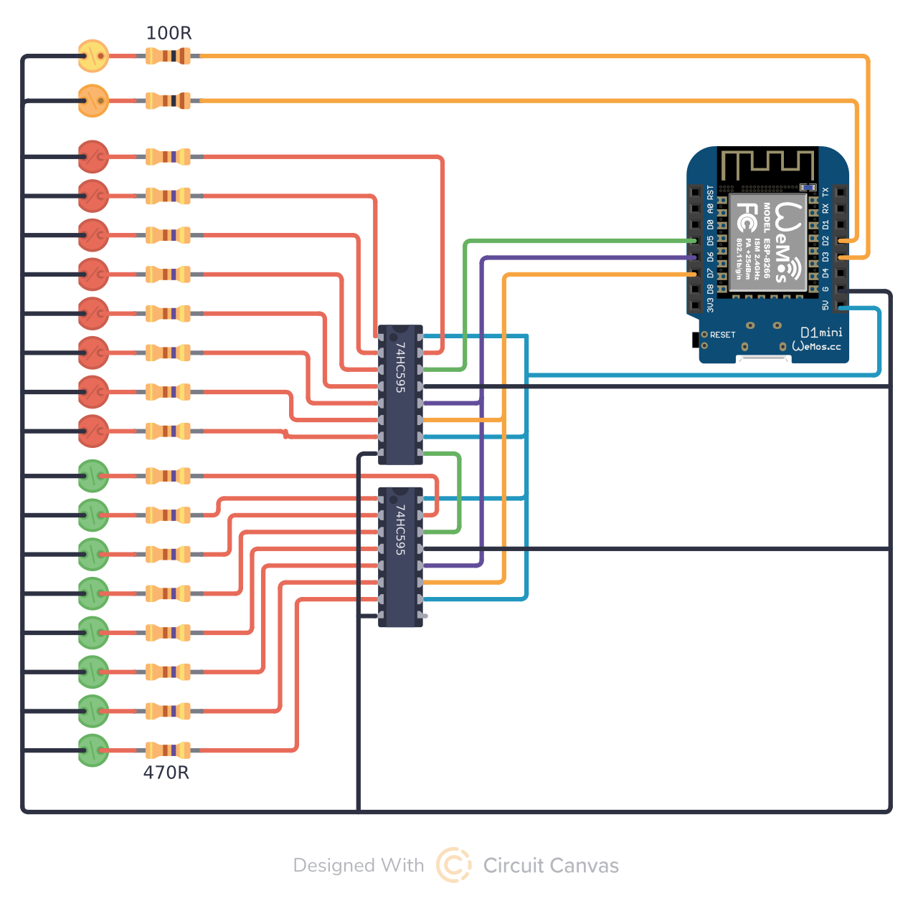

# Exocomp remote control

> control "voice" lights, phaser and random blinking leds

## Shopping list

| item             | pcs | description                                    |
| ---------------- | --- | ---------------------------------------------- |
| Wemos D1 Mini    | 1   | or similar Arduino-compatible device with WiFi |
| 74HC595          | 2   | 8-bit shift register                           |
| 470 Ohm resistor | 16  | resistor per LED on 5V                         |
| 100 Ohm resistor | 2   | resistor per LED on 3.3V                       |

## Pinout configuration

| Pin | Function          |
| --- | ----------------- |
| D2  | Phaser fire       |
| D3  | Voice pulse       |
| D4  | onboard "WiFi on" |
| D5  | DS                |
| D6  | ST_CP             |
| D7  | SH_CP             |

## Layout

