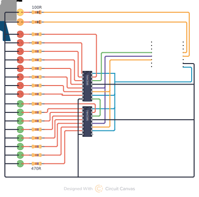

# Exocomp remote control

> control "voice" lights, phaser and random blinking leds

| Pin | Function          |
| --- | ----------------- |
| D1  | Voice pulse       |
| D2  | Phaser fire       |
| D4  | onboard "WiFi on" |
| D6  | ST_CP             |
| D7  | SH_CP             |
| D8  | DS                |

